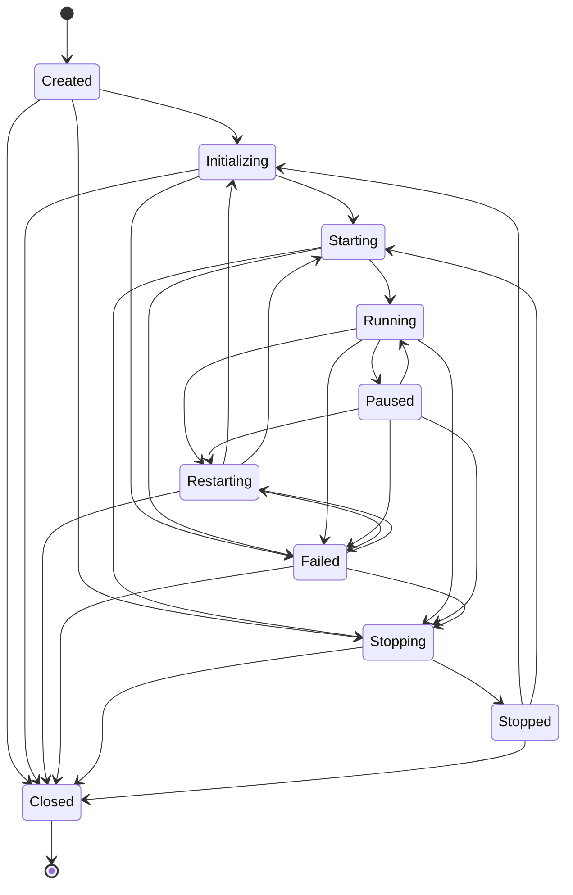
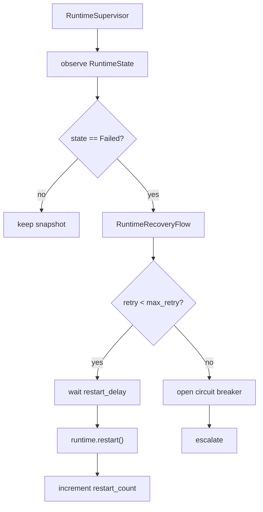
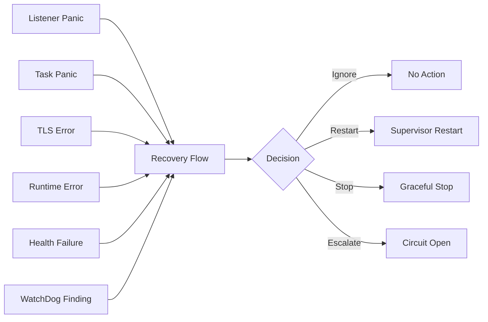

# Runtime Reliability Report

Date: 2026-07-06

Scope: TCP Runtime, HTTP Runtime, HTTPS Runtime. No protocol or tunnel type was added.

## Runtime Lifecycle Review

| Runtime | Lifecycle Path | State Alignment | Resource Release | Recovery Notes |
| --- | --- | --- | --- | --- |
| TCP | `Created -> Initializing -> Starting -> Running -> Stopping -> Stopped/Closed` | Uses unified `RuntimeState`; startup failure enters `Failed` | Listener cancellation, scheduler graceful wait, sessions closed, shutdown watch notified | Supervisor can recover `Failed` by entering `Restarting` and calling `restart` |
| HTTP | Same unified path as TCP | HTTP listener status remains internal; runtime state is unified | Listener task cancellation, request sessions closed, monitor/cleanup tasks drained | Request parsing/forwarding errors increment runtime errors instead of exiting runtime |
| HTTPS | Same unified path as TCP/HTTP | HTTPS wraps HTTP runtime state; TLS startup failures enter `Failed` | TLS listener task cancellation, TLS sessions drain through HTTP stream handling, cert cache remains owned by runtime | TLS handshake/certificate/runtime errors are routed into recovery signals |

Reviewed lifecycle dimensions:

- Lifecycle: all runtimes now share `Created`, `Initializing`, `Starting`, `Running`, `Paused`, `Stopping`, `Stopped`, `Restarting`, `Failed`, `Closed`.
- State transition: invalid restart from `Closed` is rejected; `Failed` can be supervised through `Restarting`.
- Resource release: listener, task, connection/session, channel notification, timer loops, file-like hooks, and TLS hooks have a shared graceful shutdown abstraction.
- Exception recovery: listener panic, task panic, TLS error, runtime error, health failure, and watchdog findings map to `RuntimeRecoveryFlow`.
- Long-running stability: task panics are caught and marked `Failed`, so watchdog and supervisor metrics do not leave panicked tasks as permanently `Running`.

## State Machine



## Supervisor



## Recovery Flow



## Added Reliability Components

| Component | Purpose |
| --- | --- |
| `RuntimeSupervisor` | Restart policy, restart delay, maximum retry, circuit breaker |
| `RuntimeRecoveryFlow` | Unified recovery decisions for listener/task/TLS/runtime/health/watchdog failures |
| `RuntimeHealthCheck` | Runtime Alive, Listener Alive, Tunnel Alive, TLS Alive, Connection Alive, Heartbeat |
| `RuntimeWatchdog` | Heuristics for dead loop, deadlock, long blocking, task leak, memory growth, channel blockage |
| `GracefulShutdownManager` | Ordered resource shutdown hooks for listener, task, connection, channel, timer, file, TLS |
| `RuntimeConnectionManager` | Max connection count, connection timeout policy, idle timeout, keep-alive flag, lifecycle snapshots |
| `RuntimeTaskManager` | Named Tokio task facade, statistics, cancellation, wait, panic/failure visibility |
| `RuntimeMetricsRegistry` | Runtime count, connection count, TLS sessions, memory, CPU, restart count, health score |
| `RuntimeTraceContext` | `TraceId`, `SessionId`, `TunnelId`, `RuntimeId`, `ConnectionId` correlation |

## Risk Report

| Risk | Severity | Mitigation |
| --- | --- | --- |
| Existing live runtimes still need explicit Supervisor registration | Medium | `RuntimeSupervisor::register` provides protocol-neutral registration for TCP/HTTP/HTTPS |
| OS-level memory and CPU sampling is not yet wired to a platform collector | Medium | Metrics registry has stable fields; platform sampler can feed it without changing runtime APIs |
| WatchDog detects deadlock/loop symptoms, not formal proofs | Medium | Findings are explicit heuristics and route into recovery instead of direct process exit |
| 10,000 connection stress cases can exhaust workstation file descriptors or ephemeral ports | High | Stress tests are ignored by default and must be run intentionally |
| HTTPS stress is CPU-bound due to TLS handshake cost | Medium | TLS metrics include handshake count and average handshake latency |

## Stress Report

Stress test entrypoint:

```powershell
cargo test -p gate-engine --test stress -- --ignored --nocapture
```

Implemented matrix:

| Scenario | 1000 | 5000 | 10000 | Coverage |
| --- | --- | --- | --- | --- |
| TCP short connection | yes | yes | yes | connect/write/read/close |
| TCP long connection | yes | yes | yes | connect/hold/read/write/drop |
| HTTP KeepAlive | yes | yes | yes | two requests per connection |
| HTTPS TLS KeepAlive | yes | yes | yes | TLS handshake plus two requests per connection |

Default verification run:

```powershell
cargo test -p gate-engine
```

Result: passed, including TCP/HTTP/HTTPS runtime integration tests and reliability unit tests. Stress tests compile and are ignored by default.

## Benchmark Report

Benchmark output fields are standardized for:

- CPU usage percent
- Memory bytes
- Latency
- TLS handshake count and average handshake latency
- Throughput via request/connection completion timing
- Runtime restart count
- Health score

Detailed benchmark template: `benchmark/runtime-reliability.md`.
