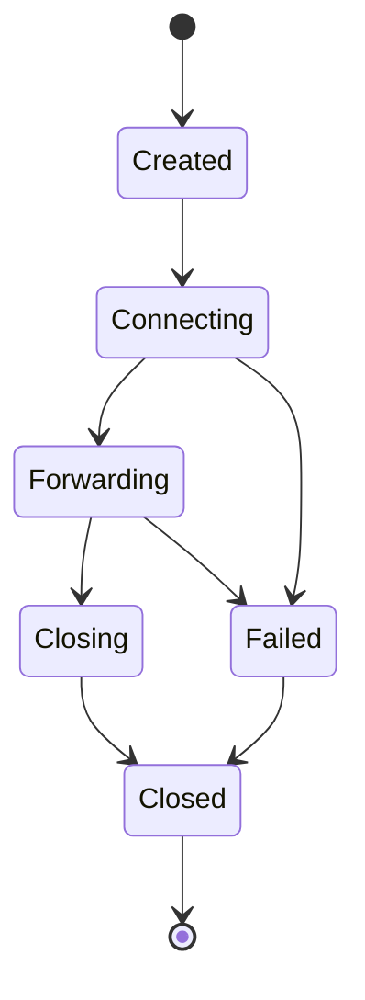

# Session

`SessionManager` owns runtime sessions from accept to close.

## Session Fields

- `SessionId`
- `TunnelId`
- `ConnectionId`
- `created_at_millis`
- `closed_at_millis`
- `remote_addr`
- `local_addr`
- per-session `TrafficStatistics`
- `SessionState`

## State Machine

## Management Rules

- The listener creates sessions after accept.
- Forward tasks update session status.
- The runtime closes all sessions during graceful stop and shutdown.
- Session snapshots are serializable for UI and diagnostics.
