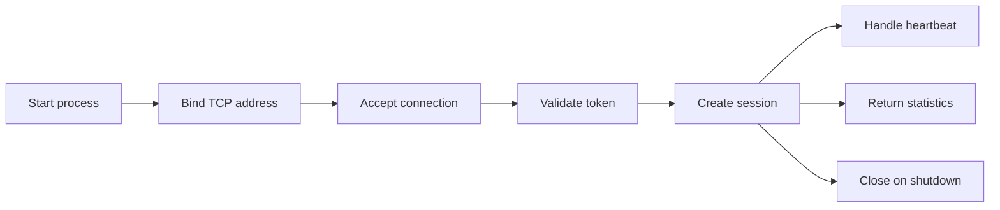

# Server

The Gate server is the self-hosted public entrypoint. In the current alpha it exposes a TCP protocol endpoint, validates token authentication, responds to heartbeat messages, and reports basic session statistics.

## Run Locally

```bash
npm run dev:server
```

This is equivalent to `cargo run -p gate-server` with the default local address `127.0.0.1:7000` and token `gate-alpha-token`.

Windows PowerShell helper:

```powershell
npm run dev:server:local
```

Customize address or token during local development:

```powershell
npm run dev:server:local -- -Addr "127.0.0.1:7001" -Token "replace-with-a-long-random-token"
```

## Configuration

| Variable | Default | Description |
| --- | --- | --- |
| `GATE_SERVER_ADDR` | `127.0.0.1:7000` | TCP bind address for the alpha server |
| `GATE_AUTH_TOKEN` | `gate-alpha-token` | Shared token required by clients |

Do not use the default token on a shared or public server.

## Production-Like Run

```bash
cargo build -p gate-server --release
GATE_SERVER_ADDR=0.0.0.0:7000 \
GATE_AUTH_TOKEN=replace-with-a-long-random-token \
./target/release/gate-server
```

## Docker Run

```bash
docker build -f docker/Dockerfile.server -t gate-server:local .
docker run --rm -p 7000:7000 \
  -e GATE_SERVER_ADDR=0.0.0.0:7000 \
  -e GATE_AUTH_TOKEN=replace-me \
  gate-server:local
```

## Lifecycle



## Operational Notes

- Place the server behind a firewall or reverse proxy if it is exposed publicly.
- Rotate `GATE_AUTH_TOKEN` if it is shared accidentally.
- Use process supervision such as systemd, Docker restart policies, or a platform supervisor.
- Capture stdout and stderr logs in your logging system.

## Related Docs

- [Authentication](./authentication.md)
- [Deployment](./deployment.md)
- [Docker](./docker.md)
- [Troubleshooting](./troubleshooting.md)
