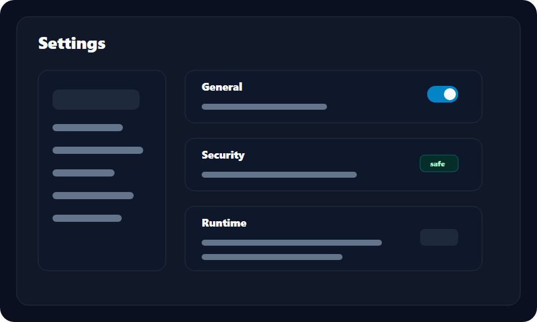

# Settings

Settings collect local preferences, server defaults, security options, update behavior, logs, and developer controls.

## Categories

| Category | Examples |
| --- | --- |
| General | Language, launch behavior, workspace defaults |
| Appearance | Theme, density, animations |
| Server | Default server, timeout, reconnect policy |
| Tunnel | Auto-start, default protocol, default project |
| Security | Token storage, redaction, session timeout |
| Logs | Retention, export format, verbosity |
| Updates | Release channel, update checks |
| Developer | Diagnostics and debug visibility |

## Defaults

Settings should be conservative:

- Do not auto-start new tunnels by default.
- Do not show tokens in plain text after saving.
- Keep destructive actions behind confirmation.
- Prefer local-only state for desktop preferences.

## Screenshot

