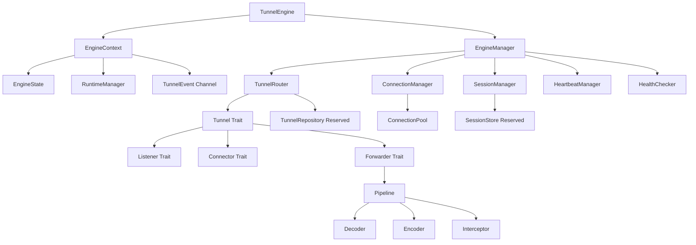
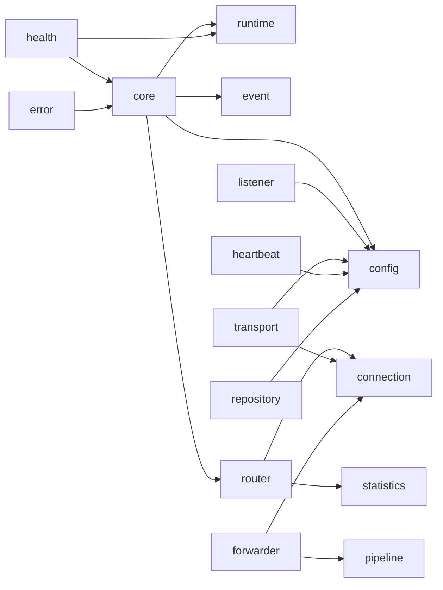

# Architecture

Tunnel Engine follows a layered, protocol-agnostic architecture.

## Module Relationship

## Dependency Graph

## Cargo Crate Plan

Current phase:

- `gate-engine`: core contracts and mock managers.
- `gate-server`: server bootstrap and engine integration surface.
- `gate-transport`: transport port definitions.
- `gate-domain`: domain entities and repositories.
- `gate-application`: application use cases.
- `gate-infrastructure`: adapters for runtime, storage, cache, config, logging.

Future split when implementation grows:

- `gate-engine-core`: lifecycle, events, errors, context, IDs.
- `gate-engine-protocol`: protocol traits and frame models.
- `gate-engine-runtime`: task orchestration and graceful shutdown.
- `gate-engine-forwarder`: forwarding and pipeline implementations.
- `gate-engine-transport-tcp`: TCP listeners and connectors.
- `gate-engine-transport-http`: HTTP listeners and adapters.
- `gate-engine-transport-quic`: QUIC transport based on Quinn.
- `gate-engine-observability`: statistics, health, tracing, audit hooks.

## Naming Rules

- Engine facade: `TunnelEngine`.
- Shared context: `EngineContext`.
- IDs: `TunnelId`, `ConnectionId`, `SessionId`, `ListenerId`, `TaskId`.
- States: `EnginePhase`, `ConnectionState`, `TunnelStatus`, `ListenerStatus`.
- Managers: `EngineManager`, `ConnectionManager`, `SessionManager`, `RuntimeManager`.
- Traits: noun or capability names such as `Tunnel`, `Listener`, `Connector`, `Forwarder`.
- Configs: `TunnelConfig`, `ProtocolConfig`, `ForwardConfig`, `RuntimeConfig`, `HeartbeatConfig`.
- Errors: `EngineError`, `TunnelError`, `ConnectionError`, `ForwardError`, `ProtocolError`.

## Rust Doc Rules

- Public modules must have module-level `//!` documentation.
- Public traits and structs must describe their architectural responsibility.
- Implementation details are documented only when behavior is not obvious.
- Future-reserved interfaces must state that they are intentionally unimplemented.

## Coding Style

- Keep the core protocol-agnostic.
- Prefer trait boundaries over concrete protocol dependencies.
- Use `BoxFuture` for async trait contracts until native async traits are adopted across the project.
- Use `DashMap` for concurrent registries and `parking_lot` for small state locks.
- Use `Bytes` for byte buffers crossing forwarding and pipeline boundaries.
- Use `thiserror` for typed errors and `anyhow` only for internal opaque failures.
- Do not introduce authentication, encryption, persistence, or parsing in the architecture phase.
