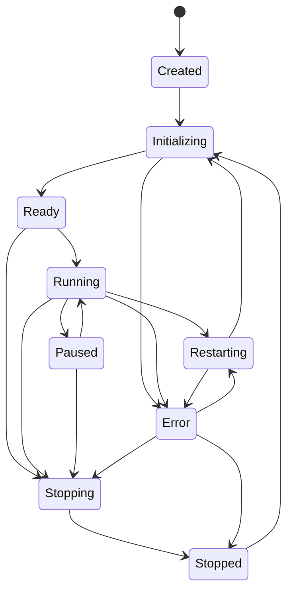

# Lifecycle

Tunnel Engine uses one unified lifecycle state model.

## States

```text
Created
Initializing
Ready
Running
Paused
Stopping
Stopped
Restarting
Error
```

## State Diagram



## Lifecycle Contract

`EngineLifecycle` defines:

- `state()`
- `initialize()`
- `start()`
- `pause()`
- `stop()`
- `restart()`

All transitions pass through `EngineState`, which rejects invalid transitions.
