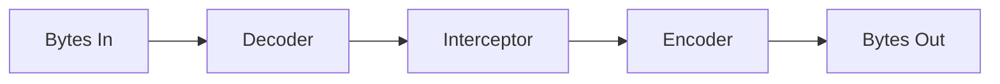
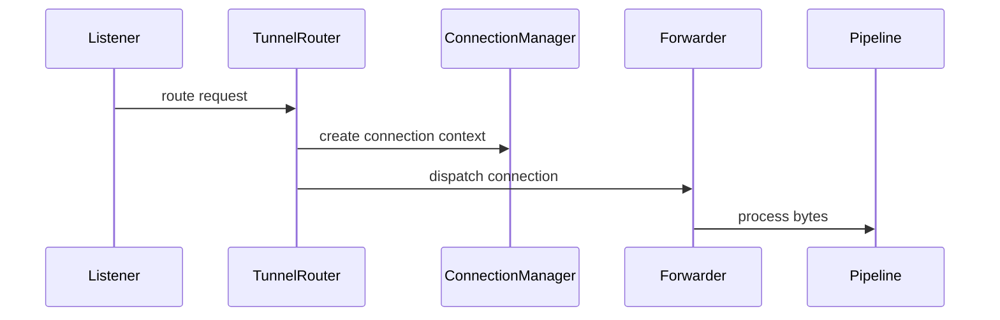

# Protocol

The protocol layer is intentionally interface-only in this phase.

## Supported Protocol Families

- HTTP
- TCP
- HTTPS reserved
- UDP reserved
- P2P reserved

## Traits

`Protocol` describes a protocol family and validates protocol configuration.

`Listener` accepts inbound traffic. Current placeholder listener types:

- `TcpListener`
- `HttpListener`

Future listener types:

- UDP
- WebSocket
- QUIC

`Connector` controls outbound connectivity:

- `connect`
- `reconnect`
- `disconnect`
- `heartbeat`

`Forwarder` controls forwarding:

- `forward`
- `close`
- `pause`
- `resume`
- `flush`

## Pipeline

Reserved pipeline capabilities:

- Compression
- Encryption
- Traffic metrics
- Audit logging

## Extension Flow

The sequence above is a future implementation target. No real forwarding is
implemented in this phase.
