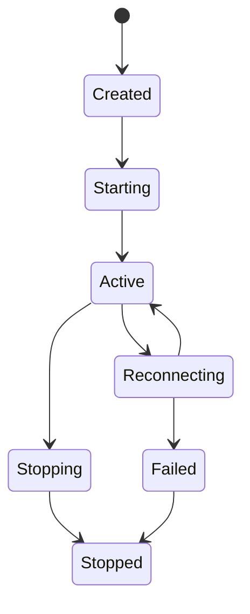

# Tunnel

Tunnels connect a local service to a remote entry point managed by Gate.

## Concepts

| Term | Meaning |
| --- | --- |
| Local endpoint | Service reachable from the client machine |
| Remote endpoint | Server-side address exposed by Gate |
| Transport | TCP, HTTP, WebSocket, or future transport binding |
| Session | Authenticated runtime connection between client and server |

## Lifecycle



## Minimal Configuration

```toml
[tunnel]
name = "local-web"
protocol = "tcp"
local = "127.0.0.1:3000"
remote = "0.0.0.0:8080"
```

## Operational Notes

- Use stable names for tunnels used by teams.
- Document exposed ports in deployment notes.
- Monitor heartbeat and connection counters for early failure signals.
