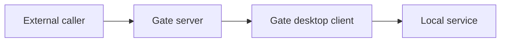

# Tunnel

A tunnel maps a local service to a remote entrypoint served through Gate. The tunnel UX is alpha, but the documentation uses one consistent contract so examples and screenshots stay aligned.

## Concept



## First Tunnel

Example: expose a local web app running on `127.0.0.1:3000`.

```toml
[server]
address = "127.0.0.1:7000"
auth_token = "gate-alpha-token"

[tunnel]
name = "local-web"
protocol = "tcp"
local_host = "127.0.0.1"
local_port = 3000
remote_port = 18080
auto_start = false
```

## Fields

| Field | Example | Description |
| --- | --- | --- |
| `name` | `local-web` | Stable human-readable tunnel name |
| `protocol` | `tcp` | Current public examples focus on TCP and HTTP |
| `local_host` | `127.0.0.1` | Host reachable from the desktop client |
| `local_port` | `3000` | Local service port |
| `remote_port` | `18080` | Public entry port on the Gate server |
| `auto_start` | `false` | Whether the client should start the tunnel automatically |

## Desktop Flow

1. Open `Tunnels`.
2. Select `Create Tunnel`.
3. Choose protocol.
4. Enter local host and port.
5. Enter remote port.
6. Assign a project and server.
7. Save.
8. Start the tunnel.
9. Watch traffic and logs.

## Naming Guidelines

- Use stable names such as `web-dev`, `mysql-staging`, or `github-webhook`.
- Avoid personal machine names in shared examples.
- Use tags for environment and ownership.

## Status Model

| Status | Meaning |
| --- | --- |
| `running` | Tunnel is active |
| `stopped` | Tunnel is saved but not running |
| `starting` | Start requested and runtime is preparing |
| `error` | Tunnel failed and requires inspection |
| `disconnected` | Client/server connection is unavailable |

## Related

- [Project](./project.md)
- [Dashboard](./dashboard.md)
- [Log Center](./log-center.md)
- [Examples](../examples/README.md)
