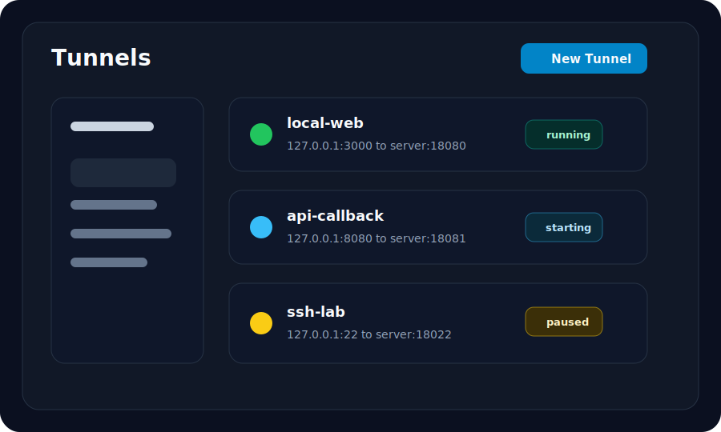

# Basic TCP

## Description

Expose a local TCP service through a Gate server. This is the smallest tunnel shape and the best place to start.

## Configuration

```toml
[server]
address = "127.0.0.1:7000"

[tunnel]
name = "basic-tcp"
protocol = "tcp"
local_host = "127.0.0.1"
local_port = 3000
remote_port = 18080
```

## Screenshot



## Run Steps

1. Start a local service on `127.0.0.1:3000`.
2. Generate a strong token and start Gate server with `GATE_SERVER_ADDR=127.0.0.1:7000` and `GATE_AUTH_TOKEN` set.
3. Open the desktop client.
4. Add the local server and token.
5. Create a TCP tunnel with the configuration above.
6. Start the tunnel and verify traffic in Dashboard.
