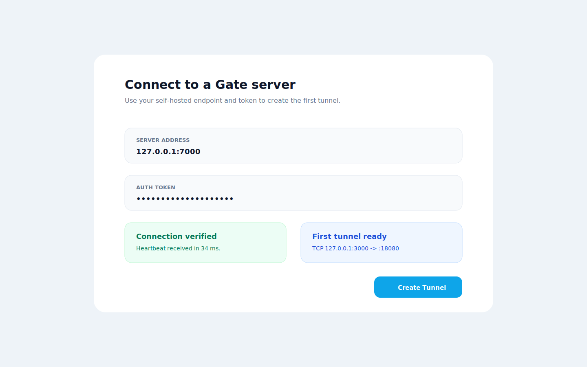

# Go Gin

## Description

Expose a local Go Gin API for demos, callback testing, or teammate review.

## Configuration

```toml
[server]
address = "gate.example.com:7000"
auth_token = "replace-me"

[tunnel]
name = "go-gin-api"
protocol = "http"
local_host = "127.0.0.1"
local_port = 8080
remote_port = 18080
```

Local app:

```bash
go run ./cmd/api
```

## Screenshot



## Run Steps

1. Start the Gin API on `127.0.0.1:8080`.
2. Start Gate server.
3. Create the `go-gin-api` tunnel.
4. Test the public endpoint.
5. Stop the tunnel when done.
