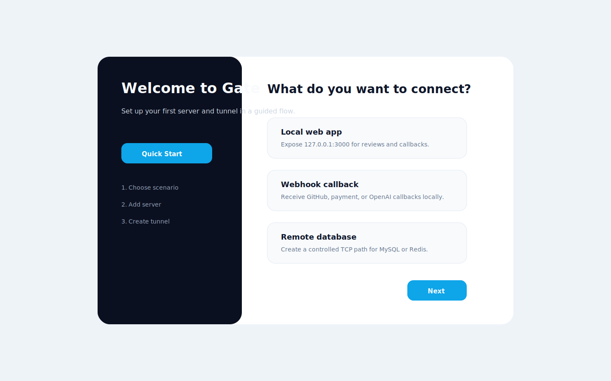

# Python Flask

## Description

Expose a local Flask service for integration testing.

## Configuration

```toml
[server]
address = "gate.example.com:7000"
auth_token = "replace-me"

[tunnel]
name = "flask-api"
protocol = "http"
local_host = "127.0.0.1"
local_port = 5000
remote_port = 18080
```

Local app:

```bash
python -m flask --app app run --host 127.0.0.1 --port 5000
```

## Screenshot



## Run Steps

1. Start the Flask service.
2. Start Gate server.
3. Create the `flask-api` tunnel.
4. Send a test request to the remote endpoint.
5. Inspect Log Center if the request fails.
