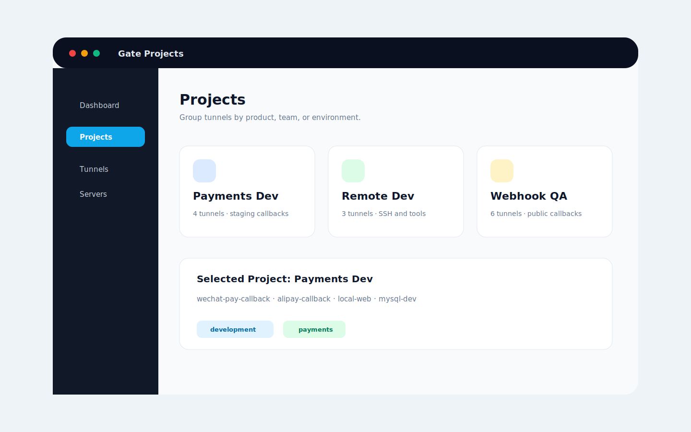

# Spring Boot

## Description

Expose a local Spring Boot service for QA, callback testing, or teammate review.

## Configuration

```toml
[server]
address = "gate.example.com:7000"
auth_token = "replace-me"

[tunnel]
name = "spring-boot-api"
protocol = "http"
local_host = "127.0.0.1"
local_port = 8080
remote_port = 18080
```

Local app:

```bash
./mvnw spring-boot:run
```

## Screenshot



## Run Steps

1. Start the Spring Boot app on `127.0.0.1:8080`.
2. Start Gate server.
3. Create the `spring-boot-api` tunnel.
4. Send a request through the remote entrypoint.
5. Watch Dashboard and Log Center.
