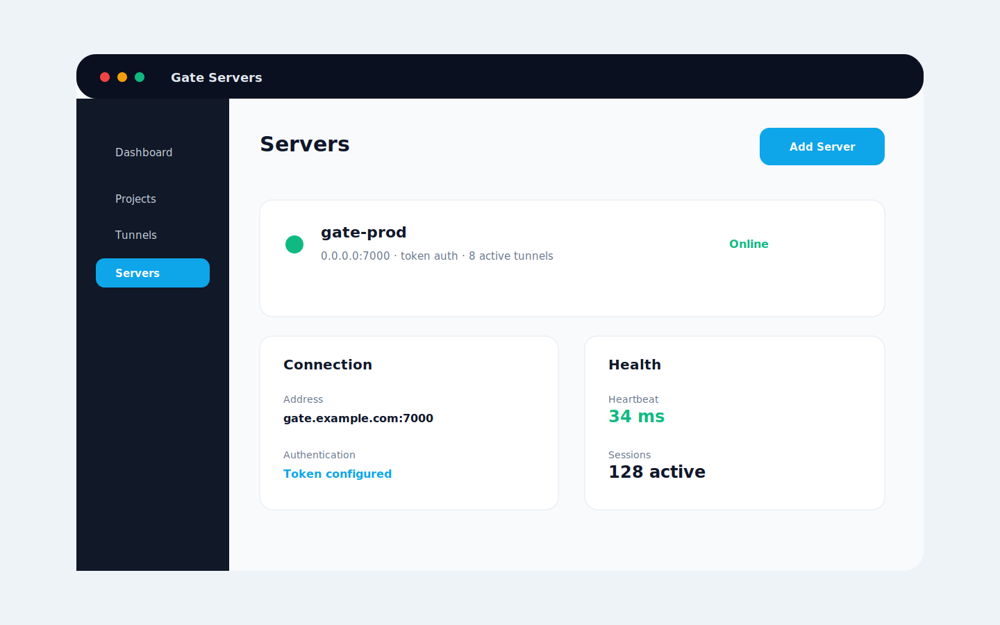

# SSH

## Description

Create a controlled TCP path to a development machine over SSH. Use this only in trusted environments and restrict access carefully.

## Configuration

```toml
[server]
address = "gate.example.com:7000"
auth_token = "replace-me"

[tunnel]
name = "ssh-devbox"
protocol = "tcp"
local_host = "127.0.0.1"
local_port = 22
remote_port = 10022
```

Client command:

```bash
ssh -p 10022 user@gate.example.com
```

## Screenshot



## Run Steps

1. Confirm SSH is enabled locally.
2. Use firewall rules to restrict who can reach the remote port.
3. Start the Gate server.
4. Create the TCP tunnel.
5. Connect with `ssh -p 10022 user@gate.example.com`.
6. Stop the tunnel when the session is complete.
