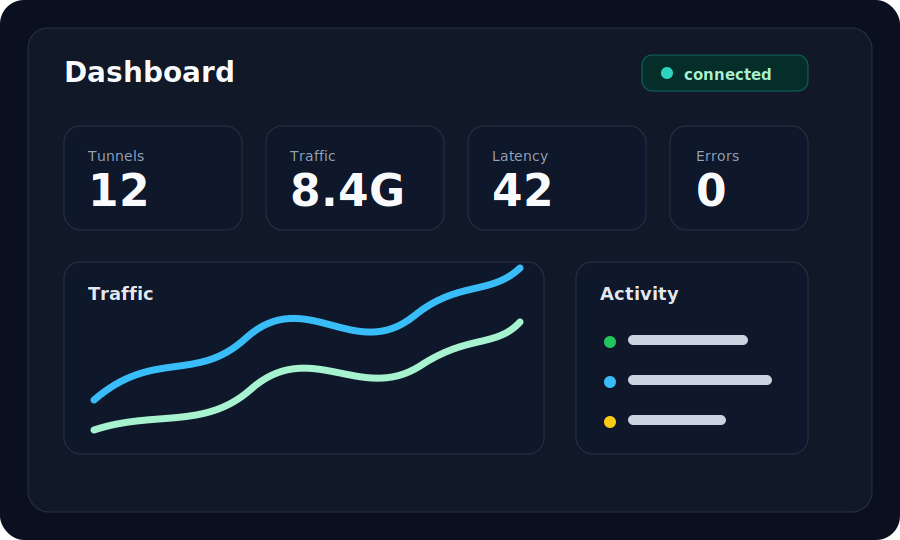

# Webhook

## Description

Receive public webhook callbacks on a local development service. Use this for GitHub, Gitea, Jenkins, payment callbacks, and integration testing.

## Configuration

```toml
[server]
address = "gate.example.com:7000"
auth_token = "replace-me"

[tunnel]
name = "webhook-dev"
protocol = "http"
local_host = "127.0.0.1"
local_port = 3000
remote_port = 18080
```

Webhook URL shape:

```text
https://gate.example.com/webhook/github
```

Use a reverse proxy for HTTPS termination.

## Screenshot



## Run Steps

1. Start your local webhook receiver on `127.0.0.1:3000`.
2. Start Gate server on a reachable host.
3. Configure TLS and routing with Nginx if needed.
4. Create the `webhook-dev` tunnel.
5. Set the provider webhook URL.
6. Send a test event and inspect Log Center.
