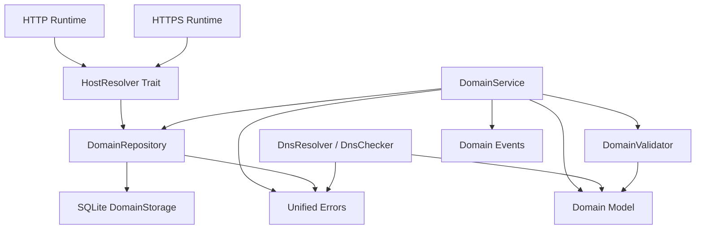

# Domain Architecture

```mermaid
flowchart TB
    HTTP["HTTP Runtime"] --> HR["HostResolver Trait"]
    HTTPS["HTTPS Runtime"] --> HR

    SERVICE["DomainService"]
    VALIDATOR["DomainValidator"]
    REPO["DomainRepository"]
    SQLITE["SQLite DomainStorage"]
    DNS["DnsResolver / DnsChecker"]
    MODEL["Domain Model"]
    ERROR["Unified Errors"]
    EVENT["Domain Events"]

    HR --> REPO
    SERVICE --> VALIDATOR
    SERVICE --> REPO
    SERVICE --> MODEL
    SERVICE --> EVENT
    REPO --> SQLITE
    DNS --> MODEL
    VALIDATOR --> MODEL
    SERVICE --> ERROR
    REPO --> ERROR
    DNS --> ERROR
```
