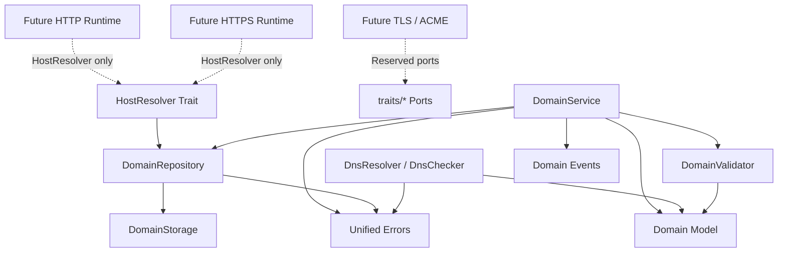

# Domain Architecture

```mermaid
flowchart TB
    HTTP["Future HTTP Runtime"] -. "HostResolver only" .-> HR["HostResolver Trait"]
    HTTPS["Future HTTPS Runtime"] -. "HostResolver only" .-> HR
    TLS["Future TLS / ACME"] -. "Reserved ports" .-> PORTS["traits/* Ports"]

    SERVICE["DomainService"]
    VALIDATOR["DomainValidator"]
    REPO["DomainRepository"]
    STORAGE["DomainStorage"]
    DNS["DnsResolver / DnsChecker"]
    MODEL["Domain Model"]
    ERROR["Unified Errors"]
    EVENT["Domain Events"]

    HR --> REPO
    SERVICE --> VALIDATOR
    SERVICE --> REPO
    SERVICE --> MODEL
    SERVICE --> EVENT
    REPO --> STORAGE
    DNS --> MODEL
    VALIDATOR --> MODEL
    SERVICE --> ERROR
    REPO --> ERROR
    DNS --> ERROR
```
