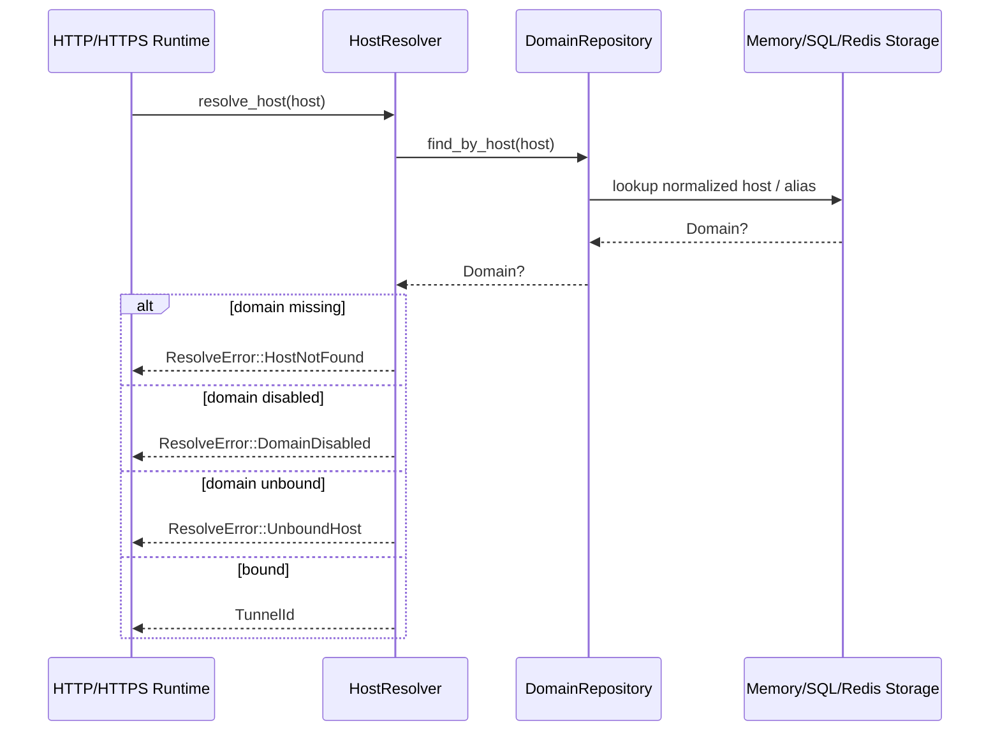

# Host Resolve Flow

```mermaid
sequenceDiagram
    participant Runtime as HTTP/HTTPS Runtime
    participant Resolver as HostResolver
    participant Repository as DomainRepository
    participant Storage as Memory/SQL/Redis Storage

    Runtime->>Resolver: resolve_host(host)
    Resolver->>Repository: find_by_host(host)
    Repository->>Storage: lookup normalized host / alias
    Storage-->>Repository: Domain?
    Repository-->>Resolver: Domain?
    alt domain missing
        Resolver-->>Runtime: ResolveError::HostNotFound
    else domain disabled
        Resolver-->>Runtime: ResolveError::DomainDisabled
    else domain unbound
        Resolver-->>Runtime: ResolveError::UnboundHost
    else bound
        Resolver-->>Runtime: TunnelId
    end
```
