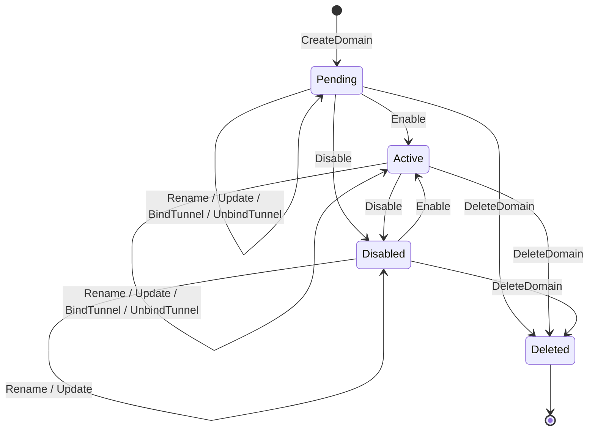

# Domain Lifecycle

```mermaid
stateDiagram-v2
    [*] --> Pending: CreateDomain
    Pending --> Active: Enable
    Pending --> Disabled: Disable
    Active --> Disabled: Disable
    Disabled --> Active: Enable
    Pending --> Pending: Rename / Update / BindTunnel / UnbindTunnel
    Active --> Active: Rename / Update / BindTunnel / UnbindTunnel
    Disabled --> Disabled: Rename / Update
    Pending --> Deleted: DeleteDomain
    Active --> Deleted: DeleteDomain
    Disabled --> Deleted: DeleteDomain
    Deleted --> [*]
```
