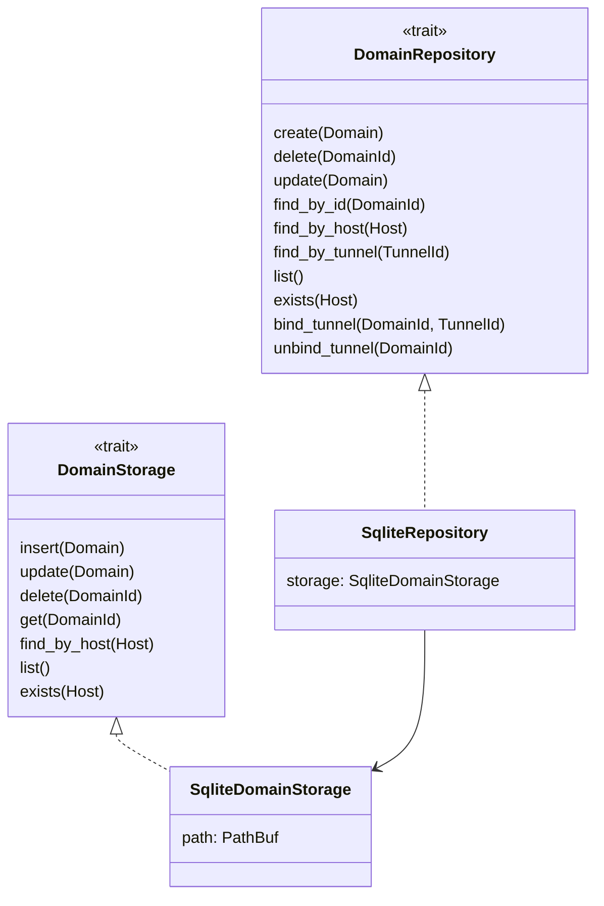

# Repository Structure

```mermaid
classDiagram
    class DomainRepository {
        <<trait>>
        create(Domain)
        delete(DomainId)
        update(Domain)
        find_by_id(DomainId)
        find_by_host(Host)
        find_by_tunnel(TunnelId)
        list()
        exists(Host)
        bind_tunnel(DomainId, TunnelId)
        unbind_tunnel(DomainId)
    }

    class SqliteRepository {
        storage: SqliteDomainStorage
    }

    class DomainStorage {
        <<trait>>
        insert(Domain)
        update(Domain)
        delete(DomainId)
        get(DomainId)
        find_by_host(Host)
        list()
        exists(Host)
    }

    class SqliteDomainStorage {
        path: PathBuf
    }

    DomainRepository <|.. SqliteRepository
    DomainStorage <|.. SqliteDomainStorage
    SqliteRepository --> SqliteDomainStorage
```
