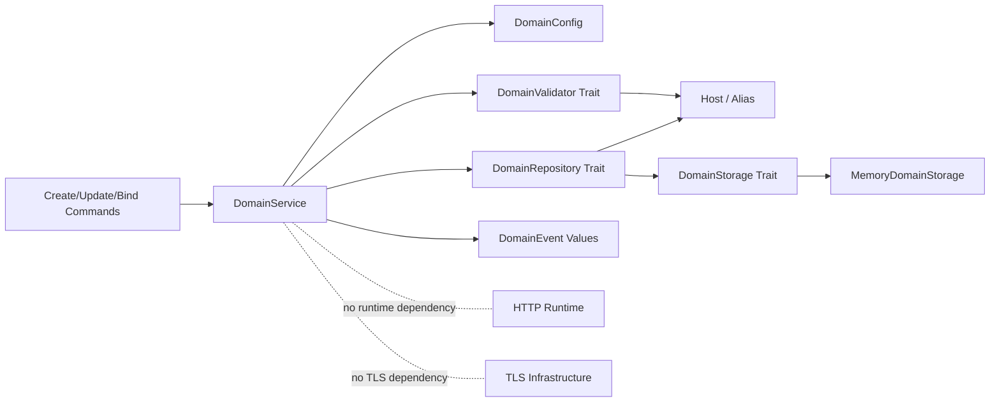

# Service Dependency

```mermaid
flowchart LR
    REQUEST["Create/Update/Bind Commands"] --> SERVICE["DomainService"]
    SERVICE --> CONFIG["DomainConfig"]
    SERVICE --> VALIDATOR["DomainValidator Trait"]
    SERVICE --> REPOSITORY["DomainRepository Trait"]
    SERVICE --> EVENTS["DomainEvent Values"]

    VALIDATOR --> MODEL["Host / Alias"]
    REPOSITORY --> MODEL
    REPOSITORY --> STORAGE["DomainStorage Trait"]
    STORAGE --> MEMORY["MemoryDomainStorage"]

    SERVICE -. "no runtime dependency" .- HTTP["HTTP Runtime"]
    SERVICE -. "no TLS dependency" .- TLS["TLS Infrastructure"]
```
