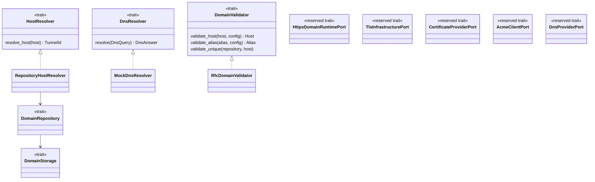

# Trait Relationships

```mermaid
classDiagram
    class HostResolver {
        <<trait>>
        resolve_host(host) TunnelId
    }
    class RepositoryHostResolver
    class DnsResolver {
        <<trait>>
        resolve(DnsQuery) DnsAnswer
    }
    class MockDnsResolver
    class DomainValidator {
        <<trait>>
        validate_host(host, config) Host
        validate_alias(alias, config) Alias
        validate_unique(repository, host)
    }
    class RfcDomainValidator
    class DomainRepository {
        <<trait>>
    }
    class DomainStorage {
        <<trait>>
    }
    class HttpsDomainRuntimePort {
        <<reserved trait>>
    }
    class TlsInfrastructurePort {
        <<reserved trait>>
    }
    class CertificateProviderPort {
        <<reserved trait>>
    }
    class AcmeClientPort {
        <<reserved trait>>
    }
    class DnsProviderPort {
        <<reserved trait>>
    }

    HostResolver <|.. RepositoryHostResolver
    DnsResolver <|.. MockDnsResolver
    DomainValidator <|.. RfcDomainValidator
    RepositoryHostResolver --> DomainRepository
    DomainRepository --> DomainStorage
```
