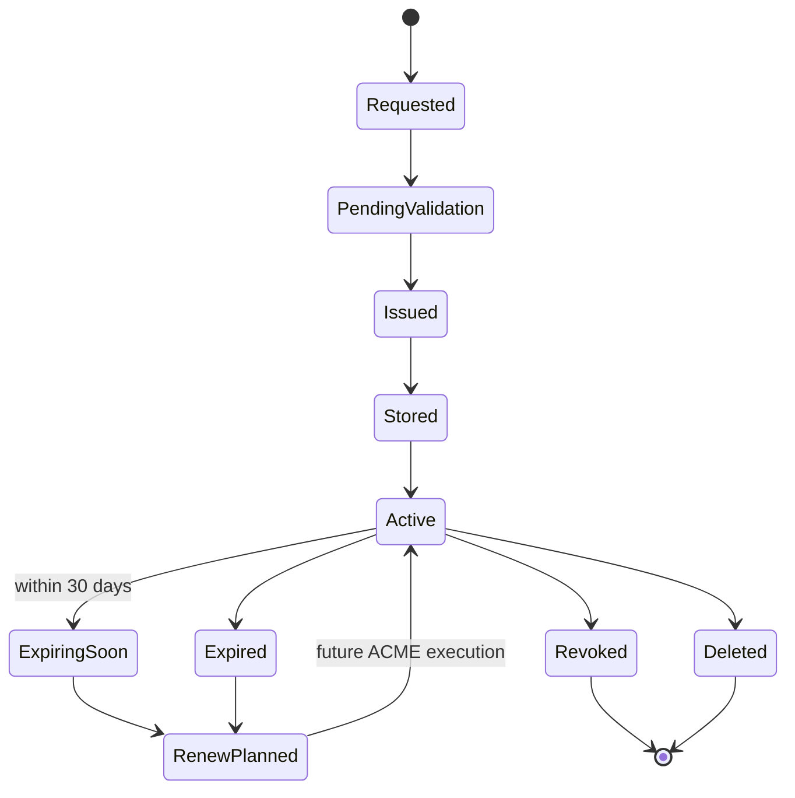
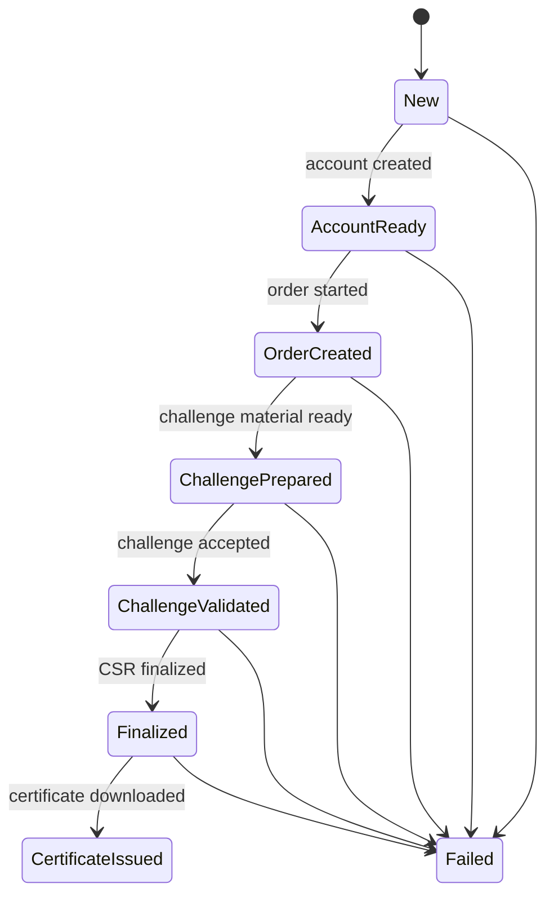
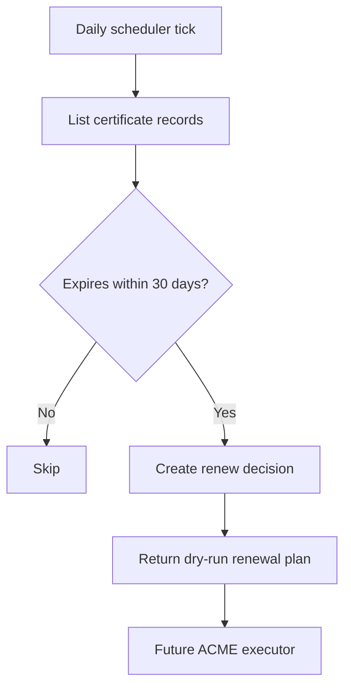
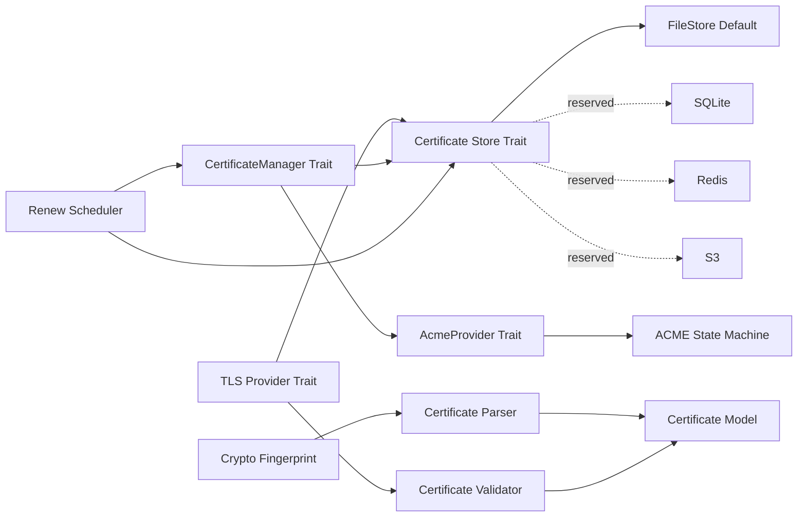

# Gate Server TLS Infrastructure

This phase introduces TLS infrastructure only. It does not implement HTTPS, does
not modify HTTP tunnel code, and does not connect to runtime services.

## Certificate Lifecycle

## ACME Lifecycle

## Renew Lifecycle

## Module Relationship

