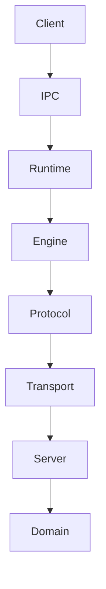

# Architecture

```mermaid
flowchart TD
  Client["Client"] --> IPC["IPC"]
  IPC --> Runtime["Runtime"]
  Runtime --> Engine["Engine"]
  Engine --> Protocol["Protocol"]
  Protocol --> Transport["Transport"]
  Transport --> Server["Server"]
  Server --> Domain["Domain"]
```

Gate keeps UI, runtime, protocol, transport, server, documentation, and automation boundaries explicit.
