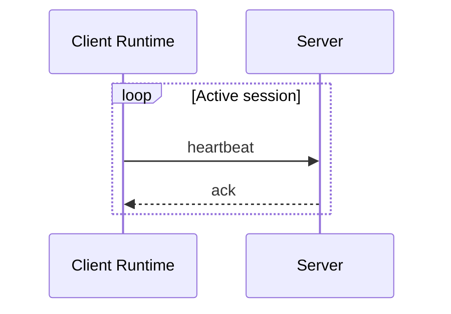

# Heartbeat

Heartbeat keeps client and server session state synchronized.

```mermaid
sequenceDiagram
  participant C as Client Runtime
  participant S as Server
  loop Active session
    C->>S: heartbeat
    S-->>C: ack
  end
```
