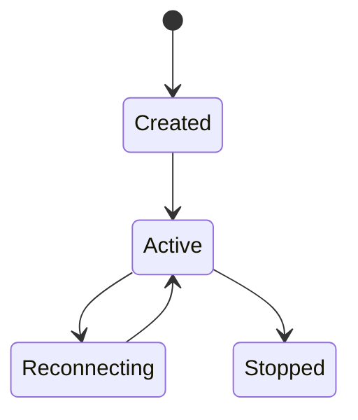

# Tunnel

Tunnels connect a local endpoint to a server-side endpoint.

```toml
[tunnel]
name = "local-web"
protocol = "tcp"
local = "127.0.0.1:3000"
remote = "0.0.0.0:8080"
```


```mermaid
stateDiagram-v2
  [*] --> Created
  Created --> Active
  Active --> Reconnecting
  Reconnecting --> Active
  Active --> Stopped
```
