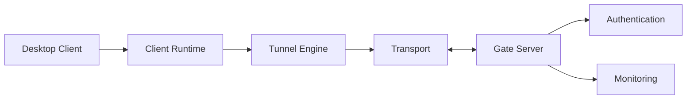

## Architecture

```mermaid
flowchart LR
  Client["Desktop Client"] --> Runtime["Client Runtime"]
  Runtime --> Engine["Tunnel Engine"]
  Engine --> Transport["Transport"]
  Transport <--> Server["Gate Server"]
  Server --> Auth["Authentication"]
  Server --> Monitor["Monitoring"]
```
