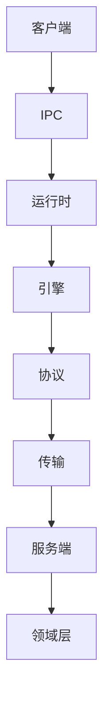

# 架构

```mermaid
flowchart TD
  Client["客户端"] --> IPC["IPC"]
  IPC --> Runtime["运行时"]
  Runtime --> Engine["引擎"]
  Engine --> Protocol["协议"]
  Protocol --> Transport["传输"]
  Transport --> Server["服务端"]
  Server --> Domain["领域层"]
```
