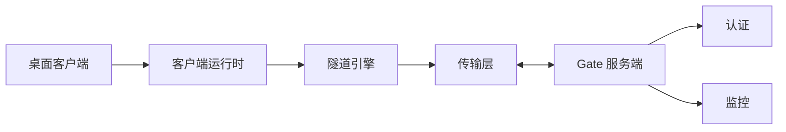

## 架构

```mermaid
flowchart LR
  Client["桌面客户端"] --> Runtime["客户端运行时"]
  Runtime --> Engine["隧道引擎"]
  Engine --> Transport["传输层"]
  Transport <--> Server["Gate 服务端"]
  Server --> Auth["认证"]
  Server --> Monitor["监控"]
```
